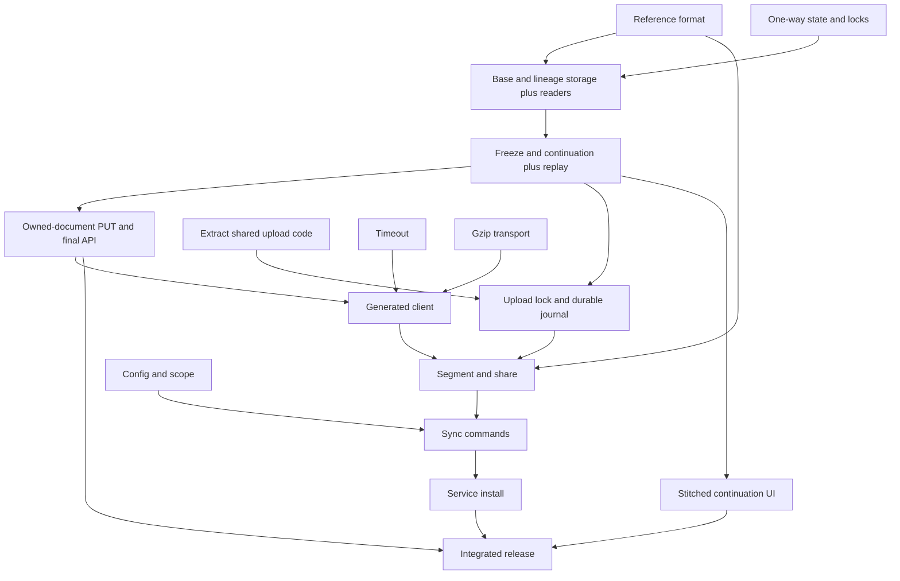

# Continuous sync: frozen graphs as revisions

**Status:** Implementation plan reflecting the agreed architecture.
**Updated:** 2026-09-10.
**Repositories:** `empathic/toolpath` and `empathic/pathbase`.

## 1. Architecture and outcome

A graph is mutable while work is in progress. Freezing permanently fixes its
content. The frozen graph itself is the revision: there is no separate graph
revision entity, immutable step-version store, or content-addressed identity.

Sync updates the current mutable graph while the session is active. After two
hours without session activity, a successful sync pass freezes that graph.
If the session resumes, sync creates a new mutable continuation referencing
the frozen head. The continuation owns only new steps and reuses frozen history.

```text
A (mutable) receives syncs
        |
        | session idle for 2 hours; sync uploads final state and freezes A
        v
A (frozen)
  +-- C (mutable continuation, created when the session resumes)
```

The UI presents A → C as one conversation with a marker at the freeze boundary.
There is no fork action in this MVP. Fork creation, harness handoff, and freezing
triggered by user actions are follow-up work.

### Invariants

- Freezing is one-way. No endpoint, CLI flag, or background task can unfreeze.
- Frozen step payloads, parent relationships, heads, path membership, and
  document metadata are immutable. Mutable descendants cannot override them.
- Later harness changes to frozen steps are ignored, including late tool
  results. No correction records or replacement versions are created.
- A child graph owns only its new steps. It references frozen history using
  graph/path/step identity; unchanged history stays stored in its source.
- Updates may change steps owned by the current mutable graph, including tool
  results that settle before that graph is frozen.
- Store explicit continuation lineage. Creation time alone must never determine
  which graph continues the original session.
- A structural base must be frozen before a dependent graph is published.
  Automatic freezing follows the inactivity policy below.
- Retry safety, authorization, and concurrent-write checks apply independently
  of the content-storage model.

### Scope

The MVP includes one-way state, freezing after two hours of session inactivity,
continuation references and inherited-history reads, efficient mutable updates,
stitched continuation UI, `[sync]` configuration, and service installation.
Whole-document upload means the complete document **owned by the current
graph**, not a flattened copy of inherited history. Streaming is unnecessary.
Provider-specific step finalization and append-only publishing are not required;
steps owned by a mutable graph can change until the graph is frozen.

New authenticated graphs default mutable; anonymous uploads remain frozen.
Migration backfills existing repo graphs as mutable and anonymous graphs as
frozen after verifying how anonymous ownership is represented. No migration
invents historical revision boundaries. Only in-scope sessions processed by
an enabled sync pass are eligible for automatic freezing.

Existing repo write permission authorizes uploads and automatic freezing. The
MVP does not add fork permissions, cross-repo branch creation, or manual freeze
controls. Manual share still uses the common upload engine, but the inactivity
policy is run by `path sync`.

Display labels and visibility are server-owned fields and may remain editable;
they are not part of immutable document content. Signature validity remains
independent of the frozen badge.

## 2. Code entry points

Read each repository's instructions before implementation, including Pathbase's
`ARCHITECTURE.md` for storage/API changes. Model relationships in the ORM.
These paths describe the checked-out code; recheck the target branch.

| Area | Entry points |
| --- | --- |
| Ingest and manifest | toolpath: `crates/path-cli/src/sync/engine.rs`, `sync/sources.rs` |
| Sharing and HTTP | toolpath: `cmd_share.rs`, `cmd_pathbase.rs` |
| Config and routing | toolpath: `share_config.rs`, `config.rs`, `remote.rs` |
| Generated client | toolpath: `crates/pathbase-client/openapi.json`, `scripts/refresh-pathbase-openapi.sh` |
| Graph routes | pathbase: `crates/pathbase-api/src/graphs.rs` |
| Storage | pathbase: `crates/pathbase-db/src/graphs.rs`, `path_steps.rs` |
| Format | toolpath: `RFC.md`, `docs/RFC-correlation.md`, `docs/RFC-jsonl.md` |

Current creation mints independent graphs and path rows. The current manifest
lock protects local writes, not upload decisions or network operations.
`path_steps::replace` deletes/copies rows; `append` inserts or ignores and owns
its transaction. Neither implements this design. Existing bare-NDJSON append
must keep compatibility while adopting state/locking/freshness rules.

The earlier timeout fix was identified as PR #248 / commit `8a03b59`: 300-second
default, `--timeout`, and `PATH_HTTP_TIMEOUT_SECS`. Verify whether it has landed
before reusing it. Do not blindly cherry-pick or regenerate stale APIs.

## 3. Frozen bases, storage, and reconstruction

### Reference identity and format

Add path-level `base.from` identifying a graph document, path, and step.
Preserve `base.uri`, `base.ref`, and `base.branch` for VCS context. The agreed
wire format is a document URI followed by a path/step fragment:

```text
<graph-document-uri>#<path-id>/<step-id>

https://<host>/u/<owner>/<repo>/graphs/<graph-uuid>#<path-id>/<step-id>
s3://my-bucket/sessions/graph-123.json#<path-id>/<step-id>
file:///archives/graph-123.json#<path-id>/<step-id>
```

The document URI identifies the remote location and the graph document; it is
not restricted to Pathbase URL structure or a UUID naming convention. There
are no separate remote or graph-ID fields and no prescribed bucket/object-key
layout. Path and step components are Toolpath IDs scoped to that document/path.

Use an absolute document URI without an existing fragment. Preserve its scheme,
authority, path, and query, including any storage-version selector. Encode path
and step IDs individually as URI components, including literal percent signs,
slashes, and hashes; split the fragment on its one literal slash before decoding
each component once. Specify parse/display round trips and malformed-reference
validation in the RFC/schema, with HTTPS, S3, and file examples. Offline format
validation checks syntax, not network availability or credentials.

The document must have a stable, immutable identity. For Pathbase this is a
frozen graph's URL. For object storage, use an immutable object location or an
object-version-pinned URI supported by that resolver, not a mutable latest key.
There is no extra Toolpath revision component; storage-specific version identity
belongs in the document URI. Never embed credentials in exported references.

The portable format accepts and preserves these references independently of
resolver support. The MVP Pathbase server resolves same-Pathbase-host document
URIs only. Validate target path and step, frozen source state, and permissions.
A target may itself have a frozen base; resolve its selected step through that
path's composed ancestry to a stored owner. Persist the original structural
reference plus its unambiguous resolved target, not an unchecked URL alone.
For other schemes/hosts, Pathbase structural ingestion returns an explicit
unsupported-resolver error. Do not reject them in the portable format, silently
drop them, or downgrade `base.from` to an annotation. S3/file/cross-host fetching
is follow-up resolver work, not a prerequisite for the sync MVP.

`meta.refs` adds a human-facing `continues` annotation.
These do not substitute for `base.from` and do not automatically create DAG
parent edges. Define vocabulary at graph/path level in RFC-correlation.

### Database relationships

Keep existing server UUIDs for steps and paths. Add a structural base relation
from a child path to its frozen source graph/path/step, with real foreign keys.
Store edges separately from payloads where appropriate in Pathbase; reconstruct
the Toolpath parents on read. Do not introduce content hashes or a second
step-version identity to implement sharing.

Store explicit graph continuation lineage and its source. One path-level base
covers the single-session sync case. Do not implement a fork/delegation type or
endpoint merely to reserve future functionality. Multi-path storage operations
must remain correct, but automatic inactivity freezing targets the single-session
graphs created/tracked by this sync engine; do not infer one session's inactivity
for an unrelated multi-path graph.

For each frozen source path, allow at most one immediate continuation in its
source repo. Enforce this atomically with a unique lineage constraint. A retry
or restored client can discover the existing continuation; it must reconcile
that child's contents before attempting writes. Continuations stay in the
source repo; changing sync destinations creates an independent upload.

A mutable child's base and lineage are fixed at creation, even while its own
steps change. Never retarget ancestry in a normal PUT. Shared history is reached
through references, not by linking the source's step rows into a writable path.
Audit legacy shared-path membership: reject writes to shared mutable rows until
all containing graph protections are satisfied; never mutate a frozen owner
through an alternate graph/path endpoint.

### Read behavior

Provide two explicit views:

- **Stored document:** this graph's own paths/steps plus structural bases; use
  it for sync comparison and exact graph download.
- **Composed path:** recursively load the base's ancestry through the selected
  step, then this path's own steps. Use it for conversation display and export
  to a harness that needs a self-contained transcript.

A continuation inherits the frozen head and its ancestors, not unrelated dead
ends in the frozen graph.
Frozen non-ancestral steps remain accessible in the source's own document/DAG.
Preserve transcript order, deduplicate inherited traversal, and detect cycles
and enforce depth/work bounds. Resolve permissions at read time for every base;
never leak private history because the creator once had access.

In stored form, root steps attach through `base.from`; materialized export
restores explicit parent IDs and an ordinary self-contained Toolpath path.
Map scoped IDs deterministically if flattening encounters collisions, updating
head and parent references together. Preserve origin metadata. Do not silently
serve a partial transcript as a complete materialized export when a base is
unreadable; UI may show a clear unavailable-history boundary.

Frozen bases with dependents cannot be hard-deleted: use FK restriction and
return `409 graph_has_dependents`. Do not cascade-delete shared history.
Visibility changes remain allowed and may make inherited history unavailable
for a viewer. Graphs without dependents can use existing deletion semantics.

## 4. Server operations and atomicity

Routes are relative to `/api/v1/u/{owner}/repos/{repo}`. Publish exact envelopes,
response metadata, and error codes in OpenAPI before client integration.

| Route | Behavior |
| --- | --- |
| `GET /graphs/{id}/meta` | Cheap state, `generation`, paths/heads/counts, bases and lineage; no transcript reconstruction |
| `POST /graphs` | Create independent graph; default mutable for authenticated callers |
| `PUT /graphs/{id}` | Replace owned mutable document with guarded apply; optional atomic `freeze_after` |
| `POST /graphs/{id}/freeze` | Permanently freeze; already frozen is an idempotent no-op |
| `POST /graphs/{id}/continuations` | Create or return main-line child based on a frozen path's head; never accept a mutable source |

Use `generation` / `expected_generation` for optimistic concurrency on mutable
operations. This integer is only a compare-and-swap token, not a historical
revision or retrievable version. The frozen graph UUID identifies history.
Clients send the generation they inspected when updating or freezing a graph;
a concurrent content update must not be silently included in an old freeze decision.

Every write follows this order:

1. Authorize source and destination using existing permission helpers.
2. Begin a transaction; resolve completed idempotency keys before executing
   another mutation, with current authorization checked on replay.
3. Lock affected graph rows in UUID order, then paths in UUID order. Membership
   writers must obey the same order. Check generation/state under these locks.
4. Validate references and apply all graph/path/step changes. Record the lean
   success result in the same transaction, then commit.

If another update wins the lock before a freeze, the freeze receives a generation
conflict. Refresh remote state and recheck local inactivity before retrying. If
the freeze wins, a subsequent PUT receives `409 frozen` and sync plans a
continuation. When final content and `freeze_after` are submitted together,
failure rolls back both: never freeze a graph while losing its final upload.

Freeze gates every document-content mutation, including legacy append, path
headers, path deletion, graph membership, and structural edges. Attempts to
return to mutable are rejected. Generation/updated_at move on actual changes,
not no-op requests; paths move only when their own data changes. Preserve
existing representation ETags; do not label a generation as a strong body ETag.

### Idempotency and recovery

New authenticated clients supply `Idempotency-Key` on mutations. Store records
scoped by principal/repo/key, bound to method, target, and exact decompressed
request-body digest. This request digest is not content-addressed step storage.

Mutation and response record commit together. Concurrent identical keys wait
and return the same result; different bodies with the same key conflict. A
retry after lost success returns the original result even if its graph has
since frozen. Retain operation identity without a short retry-expiry window.
Store lean results/digests, not whole transcripts, server-side.

Deleted successful targets produce an operation tombstone response such as
`410 operation_target_deleted`; retry never resurrects them. Existing creates
without keys may remain for old/anonymous callers, but the sync engine must
never fall back to that path. Refactor current multi-write creation so failures
leave neither partial graphs nor a freeze without its final content upload.

Distinguish `frozen`, `generation_conflict`, `idempotency_conflict`, invalid
base/lineage, `graph_has_dependents`, auth failures, and validation errors.
Do not treat every `409` as a freeze. Main-line uniqueness supplements request
idempotency; it does not grant permission to overwrite an existing child.

## 5. Efficient mutable updates and inherited-step filtering

Whole-document PUT is authoritative only for steps owned by the addressed
mutable graph. Validate that IDs do not redefine any inherited step. Reject a
request that submits an inherited step as a local replacement, even under
`--force`. The CLI strips those entries before upload; server checks defend
the invariant for all producers.

Match owned paths/steps by scoped Toolpath ID and preserve server UUIDs. Batch
load incoming rows into a transaction-local table, using the existing binary
COPY encoder. Upsert JSONB only when different; rebuild metrics/tool invocation
side rows only for changed steps. Delete absent owned steps with scoped
anti-joins and update parent edges for affected children/newly arrived parents.
The apply helper takes the caller's transaction. Use ORM/query builders where
possible and isolate necessary bulk SQL in the step-store layer.

Extract projection/edge inputs in one targeted parse; keep raw step payloads
where practical to avoid repeated serialization. Reuse or clear the staging
table correctly for multiple paths. Update headers/timestamps only on changes
and return counts/metadata without reading back the transcript.

Preserve input order. If existing `seq` storage cannot represent an insertion
or reorder, reject it explicitly until supported. Reject duplicate IDs, invalid
heads/parents, omitted existing owned paths, and retargeted bases atomically.
Owned-step deletion remains supported; explicit membership removal is separate.
A segment head must resolve within its owned steps or frozen base. Automatic
continuation creation requires new steps; empty user-created branches are out
of scope.

### Project a full harness derive into a graph segment

The server's frozen state is authoritative, not a historical local snapshot.
After observing a freeze, obtain the stored source and its bases to establish
which scoped IDs are fixed, what ancestry is inherited, and the boundary head.
Keep this frozen boundary locally for later segmentation.

- Ignore payload/parent changes and omissions for frozen IDs. Do not reinsert
  those IDs with new content, generate corrections, or demand byte equality
  between the live derive and frozen history.
- For the current mutable graph, retain its existing owned steps and genuinely
  new steps. Tool-result updates to those owned steps remain valid.
- For a new continuation, include only new steps connected to the frozen head
  through representable ancestry; attach boundary roots using `base.from`.
- A moved head alone is insufficient: it may be a switch among already frozen
  steps. Create a continuation when there are eligible new steps, not merely
  when the head string differs. Do not create empty continuations.
- New work branching from another frozen step belongs to a fork, not a silent
  main-line continuation. Fork creation is deferred; if a derive cannot be represented by the selected
  base (for example, multiple external parent edges), report an unsupported
  branch shape. Never drop required edges or duplicate frozen history to hide it.

The server retains frozen dead ends too; a continuation cannot revive one by
claiming its ID as a new local step. Resuming from such a step requires future
fork support; report the unsupported shape rather than suggesting a nonexistent command.
ID matching is scoped by provider/session/path provenance, not just a short
UUID prefix or coincidentally equal strings from another harness.

Failed derives must not upload old cached bytes under a new source stamp.
Loss of previously acknowledged **owned mutable** steps is a source-regression
error for automatic sync; explicit manual force can accept that replacement.
Absence of inherited steps in a tail-only source is not a regression. Keep
baseline owned IDs/content so these cases can be distinguished.

Compress bodies above 256 KiB. Test that size limits apply after decompression.
Apply the timeout fix and return `{id, url, state, generation, base, lineage,
paths: [...counts, head...]}` rather than a reconstructed transcript.

## 6. Client planning, sharing, and UI

Extract a common upload engine for single share, bulk share, and sync. Keep
scope resolution, segmentation, classification, HTTP execution, and persistence
separate so each can be tested. Anonymous share remains outside tracked sync.

### Durable state and locking

Identify sessions by provider/full session ID and destinations by normalized
server/owner/repo. Use one advisory upload lock shared by share and sync,
held across decisions, HTTP, and recording results. Keep the manifest lock for
short read-modify-write cycles only; lock order is upload then manifest.

Persist current graph, acknowledged owned document/heads/IDs, source stamp,
observed state/generation, and frozen base/provenance. Reapply the same base and
annotations on every update; a re-derive must not erase lineage. Observing
metadata never acknowledges unsent source content.

Before sending, durably stage the exact request bytes, method/target, random
operation key, precondition, source stamp, and segmentation information.
Acknowledge by atomically advancing manifest state after retaining needed
baseline data, then clean up the pending payload. Replay unresolved operations
with identical bytes/key before creating a new operation for that destination.
Local payloads contain no credentials and use private session-data permissions.

A definitive rejected PUT after a freeze has made no write: retire that pending
operation and re-segment under a fresh continuation key. A timeout is ambiguous:
replay it first, rather than inventing a continuation that could duplicate work.
Adopting an existing continuation found through lineage requires comparing its
owned content; do not mark the newest local derive as uploaded by assumption.

Migrate old records by fetching remote metadata/document when needed; missing
state is unknown. Confirm permissions, source identity, and current lineage.
Do not auto-create another main-line child just because local state was lost.

### One pass

1. Validate config/credentials, resolve eligible destinations, acquire upload
   lock, and reload records. Never recover a pending upload to an excluded or
   changed destination; retain it for explicit recovery.
2. Resume eligible pending operations. Derive selected sessions using existing
   ingestion, retaining the source stamp associated with those bytes.
3. Read current graph metadata even for unchanged source stamps, to discover
   freezes or remote deletion. Evaluate inactivity even when nothing needs uploading.
4. Reconcile remote content drift; segment against frozen bases; choose the
   action below and stage/execute/acknowledge it. Finalize eligible idle graphs
   using the inactivity policy, including on the first upload of an old session.
5. Write status atomically. Continue independent sessions after per-session
   failures and exit nonzero when any eligible operation failed.

| Condition | Action |
| --- | --- |
| No acknowledged graph or pending operation | Idempotent independent create |
| Mutable graph, owned content unchanged, active | Skip upload |
| Mutable graph, owned content unchanged, idle at least 2 hours | Generation-checked freeze after freshness checks |
| Mutable graph, owned content changed | Generation-checked PUT; include `freeze_after` if idle and final state verified |
| Frozen graph, no eligible new steps | Skip; do not create empty automatic continuation |
| Frozen graph, new main-line steps | Create/discover continuation at frozen head; record it as current |
| Frozen graph, new work rooted elsewhere | Report unsupported branch shape; fork functionality is deferred |
| PUT reports frozen | Refresh frozen boundary and reclassify in this pass |
| Remote mutable content differs from acknowledged baseline | Report conflict; no multi-writer merge or silent overwrite |
| Confirmed deleted leaf graph in accessible repo | Report deletion; explicit manual share may recreate, automatic sync does not guess missing ancestry |
| Permission failure or unreadable base | Error, never anonymous fallback or invented replacement history |
| Unsupported server API | Upgrade-required error, never duplicate-producing POST fallback |

A generation change may be a freeze or display/visibility edit. Compare stored
owned content with the acknowledged baseline when necessary; head/count alone
cannot prove equality. Frozen payloads always win over the live derive. A
manual force can replace mutable owned content with a fresh precondition but
cannot alter inherited history or bypass freezing.

### Automatic freezing: two hours of session inactivity

`path sync` owns this policy. No server timer freezes graphs based on upload
age, and no separate daemon is needed beyond the scheduled sync pass. The
threshold is fixed at two hours in the MVP. With a 15-minute interval, freezing
normally happens on the first successful pass after that threshold; sleeping,
offline, disabled, or failing clients freeze later. Do not promise an exact
wall-clock deadline.

Track source activity, not `graphs.updated_at`, upload time, or the last user
prompt. Tool results and other session-source changes count as activity even
if the derived graph content is unchanged. Reuse each provider's source stamp:
file/chain modification time or database update time, plus size/change detection.
Do not use directory mtimes as session activity. Background work that writes
nothing to the session does not postpone this heuristic; do not add task-liveness
tracking or provider finalization as an MVP prerequisite.

Persist `last_activity_at` and the last observed source stamp per session,
separately from acknowledged upload state. Initialize from a reliable provider
activity timestamp; if missing/unusable, initialize to observation time and wait
two hours. Any subsequent detected source change advances activity to at least
the current observation time, even if its timestamp regresses. Unknown freshness
or a future timestamp must not qualify a graph for freezing. Persist observations
across restarts; repeated reads of an unchanged source do not reset inactivity.

Before freezing:

1. Obtain a fresh source stamp, derive/load its verified current content, and
   confirm the source has been idle for at least two hours. Resolve pending
   uploads first; failures/conflicts cannot qualify a stale graph for freezing.
2. Recheck the source stamp immediately before staging the freeze request. If
   it changed, record new activity and defer the freeze.
3. If remote owned content needs updating, use one generation-checked PUT with
   `freeze_after: true`. If it already matches, use generation-checked freeze.
   For the first upload of a verified idle session, create it frozen atomically.
4. Acknowledge the exact staged result. If freezing failed, leave the graph
   mutable and retry normally; do not mark it frozen locally in advance.

There is no atomic transaction between a harness file and the server. If activity
resumes after the final source check, the accepted freeze still stands. The next
pass creates a continuation for new steps; late changes to now-frozen steps are
ignored under the existing invariant. Do not add filesystem locks on harness
stores to eliminate this race. Recheck activity before retrying a definitively
rejected freeze; replay an ambiguous request first to establish its outcome.

A resumed session may be discovered only after it has already become idle again.
Create its nonempty continuation frozen if the same verified two-hour test
passes, rather than needlessly waiting another two hours. Do not create a new
graph merely because an already frozen session remains idle.

### Stitched continuation UI

Use the composed-path reader for transcripts. Follow explicit continuation
edges, display freeze boundaries, and avoid counting inherited steps twice.
Individual graph URLs remain addressable. Show mutable/frozen status and explain
that two hours of inactivity closes a graph and resumed work continues in a new
one. Do not add fork buttons, manual freeze controls, or unfreeze controls.

## 7. Configuration and service lifecycle

Use the existing user config location (normally `~/.toolpath/config.toml`),
including supported config-directory overrides. Do not add repo-local upload
routing or a second sync configuration store.

```toml
[sync]
enabled = true                    # absent/false means no automatic upload
include = ["~/empathic", "~/oss"] # empty means all sessions
harnesses = ["claude", "codex"]   # omitted means all supported agent providers
default_remote = "ben/pathstash"
interval = "15m"

[[project]]
dir = "~/empathic/oss/toolpath"
remote = "https://pathbase.dev/u/empathic/toolpath"
sync = false
```

Scope is the union of included directory subtrees intersected with selected
providers. Unknown session directories are excluded for scoped sync and
included for explicit global sync. Reuse provider-aware matching for encoded
paths and the existing normalization for deleted checkout directories.

Resolve `sync` and `remote` independently: the most specific matching rule
that defines the field wins; equal specificity uses the first rule. Omitted
`sync` inherits/defaults true. Destination precedence is `--repo`, project
remote, `[sync].default_remote`, then authenticated `<you>/pathstash`. Destination
flags do not bypass a `sync = false` exclusion. Manual `share` is not disabled
by automatic-sync opt-outs.

```text
path sync
path sync --dry-run
path sync --include <dir> [--include <dir> ...] [--harness <name>] [--repo o/n]
path sync --all
path sync status
path sync install [--include <dir> ... | --all] [--interval 15m] [--default-remote o/n]
path sync uninstall
```

One-off scope flags replace config scope for that run; `--all` and `--include`
are mutually exclusive. Keep `enabled = false` authoritative for sync passes,
even with scope flags. Disabling sync also disables its automatic freezing.
Ambiguous session/provider/destination selections fail with candidates instead
of changing several graphs. `--dry-run` may derive and read metadata but never
replays pending writes, mutates remote state, or advances upload records.

`install` merges supplied values into `[sync]`, preserving unrelated config,
then writes/loads a launchd agent or systemd user service plus timer. It runs
an absolute path to the binary with plain `path sync`, using the configured
config-directory selection. Scope/destination flags are not baked into the
service. The scheduler interval is generated from config; changing it requires
rerunning `install`. Other config edits take effect on the next pass.

Preserve an existing explicit scope on reinstall. On first enablement require
`--include` or `--all` unless an explicit scope is already configured; do not
turn a missing scope into a whole-machine upload as a side effect. A manually
configured empty include list remains global. Show effective scope and
routing after installation. Validate config before replacing files; report a
partial service-install failure accurately. Installation/uninstallation must
be repeatable and handle binary/config paths containing spaces.

`uninstall` disables sync before unloading/removing the service. Retain
config, upload records, and pending operations. A pass checks enabled/scope
again before sending its next operation; already accepted requests may finish.
Service files necessarily live in OS user-service directories, in addition to
normal state under the config directory. Windows scheduling is deferred.

Status records last start/completion, effective destinations, created/updated/
continued/skipped counts, pending operations, and bounded error summaries.
Distinguish settled frozen changes, source regressions, and remote conflicts.
Use bounded exponential backoff with jitter for network/5xx failures; leave
unresolved operations pending for the next pass. Do not retry validation or
authorization errors blindly. Never log credentials or full transcripts.

## 8. Implementation dependencies

These are reviewable outcomes, not line-count/time estimates. A task being
independent of storage does not mean it is independent of other client work.

| ID | Repo | Deliverable | Depends on |
| --- | --- | --- | --- |
| C1 | toolpath | Timeout fix after checking branch | — |
| C2 | toolpath | Config, scope and destination resolution | — |
| C3 | toolpath | Extract common share execution while preserving behavior | — |
| T1 | both | Gzip client/server transport and decompressed-limit tests | — |
| F1 | toolpath | `base.from` schema/types/validation and relationship vocabulary | — |
| S1 | pathbase | One-way state, generation token, shared mutation gates/locking | — |
| S2 | pathbase | Structural base/lineage storage, restricted deletion, stored/composed readers | S1, F1 |
| S3 | pathbase | Atomic idempotent create/freeze/continuation, uniqueness and metadata API | S2 |
| S4 | pathbase | Efficient owned-document PUT, base-aware validation, atomic freeze-after, OpenAPI | S3 |
| C4 | toolpath | Shared upload lock and durable operation journal against agreed replay API | C3, S3 |
| C5 | toolpath | Generated client and wrappers | S4, C1, T1 |
| C6 | toolpath | Segmentation, freeze recovery, continuation discovery and share integration | C4, C5, F1 |
| C7 | toolpath | One-pass sync/status/dry-run and persisted two-hour inactivity policy | C2, C6 |
| C8 | toolpath | Config-writing service install/uninstall | C7 |
| W1 | pathbase | Stitched continuation view, freeze boundaries and state display | S3 |
| R1 | both | Integrated acceptance, release docs, required versions/changelogs | C8, W1, S4 |

Start C1, C2, C3, T1, F1, and S1 after assigning file ownership; T1 and C1/C3
may touch the same HTTP helpers. Structural reference design can proceed beside
state work, but server continuation storage depends on both. Client journal design
can start after the replay contract is agreed, without waiting for deployment;
integration requires the implemented API. Service templates can be prototyped
after C2, but a working installation depends on C7.



Do not publish the new sync client before the complete server contract exists.
No legacy-server fallback may reinstate duplicate-producing uploads. Update
Pathbase architecture documentation with the frozen-graph-as-revision rule.

## 9. Acceptance criteria

Run each repository's required formatting/lint/tests. Use real PostgreSQL tests
for transactions, races, FK restrictions, and uniqueness; HTTP mocks alone
cannot demonstrate correctness.

| Scenario | Required result |
| --- | --- |
| Session idle less than 2 hours | Remains mutable |
| Unchanged session reaches 2 hours | Next successful pass freezes; no content upload required |
| Old session first uploaded after 2 hours idle | Current verified content created frozen atomically |
| Late tool result changes source while idle | Activity timer resets even if derived content is unchanged |
| Activity timestamp missing, regresses, or lies in future | Conservative observation tracking; no premature freeze |
| Client restarts during idle period | Persisted last activity survives; reads do not keep resetting timer |
| Source changes before final freeze check | Freeze deferred and activity recorded |
| Upload or validation fails | No stale-content freeze |
| PUT with freeze-after fails | Neither partial content nor freeze commits |
| Another remote write races freeze | Generation conflict; refresh and re-evaluate before retry |
| Source resumes after freeze request accepted | New steps continue; frozen step changes ignored |
| Resumed session is already idle when discovered | Nonempty continuation can be created frozen after verification |
| Disabled, offline, or dry-run pass | No automatic freeze request; deadline is not a server timer |
| Request tries to unfreeze | Rejected through every API surface |
| Late result changes a frozen step | Ignored by sync even alongside new turns; no replacement/correction row |
| Late result changes an owned mutable step | Only that row/projections update, retaining UUID |
| Source moves head among frozen IDs | No empty or duplicate continuation |
| Source omits inherited history | Not a source-regression error; frozen base supplies it |
| Source loses owned mutable step | Automatic sync reports regression; explicit force affects owned rows only |
| New work rooted at a different frozen step | Unsupported shape reported; no fork action or silently dropped edge |
| Freeze C and continue again | A → C → D reconstructs correctly, with each boundary once |
| Two clients create main-line continuation | Unique lineage yields one child; reconcile content before adopting |
| Response lost / crash before manifest save | Exact operation replay returns same target; no duplicate graph |
| Successful PUT froze before retry | Replay returns original success; no spurious second continuation |
| PUT definitively rejected as frozen | Old pending operation retired, new segment staged with new key |
| Mutable shared path linked to frozen owner | Alternate route cannot mutate frozen content |
| Child PUT resubmits inherited ID or retargets base | Rejected atomically, including force |
| Delete frozen base with dependents | Rejected; no cascade or dangling lineage |
| Viewer loses base permission | No private history leak; clear unavailable-history behavior |
| Stored download vs composed export | Stored segment preserves base; composed format restores IDs/parents/order correctly |
| Identical owned PUT | Content and side rows untouched; generation/timestamps unchanged |
| Multiple paths, invalid IDs/head/order | Correct scoped validation; transaction rolls back all changes |
| Gzip expands over body limit | 413 before any graph mutation |
| Disabled/excluded/dry-run | No pending writes replayed or new remote mutations |
| Install/reinstall/uninstall | Config preserved, paths quoted correctly, stale disabled service cannot upload |

Record representative transfer sizes, parse/apply time, statement count and
rows changed for large owned segments. Measure composed-read cost across a
chain and verify ancestors aren't duplicated in storage or displayed twice.
No machine-dependent timing thresholds are required. An unchanged content
update may still incur lock, staging, and idempotency bookkeeping writes.

## 10. Deferred work

- **Additional document resolvers:** S3, local files, and cross-host graph
  documents use the same reference format. Define resolver-specific version
  pinning, credentials, access rules, and retention before enabling resolution;
  accepting a URI in the format does not authorize arbitrary server-side fetching.
- **Fork actions and action-triggered freezing:** explicit branch creation,
  source-step selection, atomic freeze-and-fork, fork permissions, cross-repo
  branches, and branch UI. No fork endpoint or user workflow ships in this MVP.
  Manual freeze commands/controls are also deferred; the server freeze primitive
  exists to support the inactivity policy.

- **Watch mode:** reuse the same engine with dirty-session triggers, debounce,
  bounded latency, and periodic reconciliation. It does not require streaming.
- **Streaming:** send deltas for mutable owned steps using RFC-jsonl semantics.
  Resolve replay, chunk acknowledgment, metadata deletion, signatures, and
  body-limit behavior first. Frozen history remains immutable; streaming never
  introduces inherited corrections. Keep bare-NDJSON compatibility explicit.
- **Delegation/handoff:** reuse frozen structural bases and typed relationships;
  add provider provenance integration and sub-agent path derivation separately.
  Do not automatically grant freeze permission to a reader of the source.
- **Merge-back/multiple external parents:** extend parent-reference grammar and
  readers when needed. Do not force these DAGs into a single-base approximation.
- **Content hashes:** optional measured comparison/transport optimization, not
  identity or a prerequisite for frozen-history reuse.
- Windows scheduling, pull sync, multi-writer merge, plugin commands, and
  redaction/filtering remain separate. Keep one document-preparation stage
  before durable upload staging for future filtering.

There is no deferred separate revision-store requirement: frozen graphs already
provide immutable identity and retained history. Structural references, base
retention, and stitched reads are part of this implementation, not post-MVP
prerequisites to be postponed while shipping full-copy continuations.
